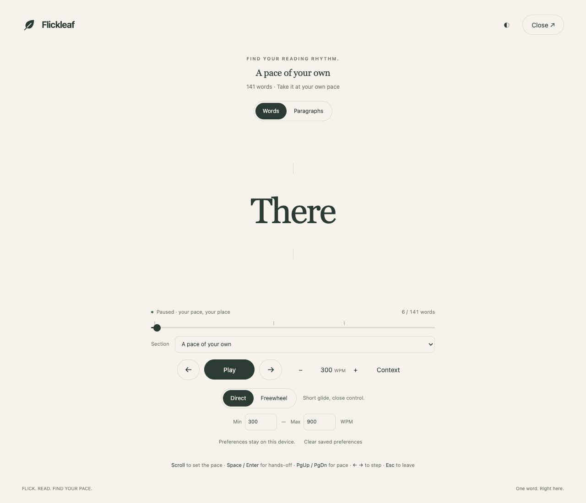

# Flickleaf

Flick. Read. Find your pace.

[Read in your browser](https://miguelbarroso.com/flickleaf/) · [About Flickleaf](https://miguelbarroso.com/flickleaf/about/)

A local-first web reader and Firefox/Chrome/Safari extension presenting article text one word at a time. Scroll or drag to control forward and reverse playback; let go to settle toward a pause. Text and PDFs are processed on your device, without accounts or document uploads. The website still requires hosting and ordinary page requests; extensions bundle their reader code locally.

[One-minute guide](docs/quick-start.md) · [Contribute](CONTRIBUTING.md)



## Availability — 5 October 2026

The web reader is live at version 0.8.0. Firefox 0.8.0 is approved and publicly available on the [official Firefox listing](https://addons.mozilla.org/en-US/firefox/addon/flickleaf/).

Chrome remains a manual developer install. Safari remains an unsigned Xcode project; there is no Chrome Web Store or App Store release. GitHub release packages are currently drafts, so public users should build from source using the instructions below. On iPhone or Android, use the web reader now; physical-device extension testing remains pending.

## Try it in Firefox

Requires desktop Firefox 142 or newer. Clone this repository, run `npm ci` and `npm run build` (see Development), then load the generated `dist/` directory.

1. Open `about:debugging#/runtime/this-firefox` in Firefox.
2. Choose **Load Temporary Add-on…** and select `dist/manifest.json`.
3. Open an article, then click **Flickleaf** in Firefox's extensions menu.
4. If extraction misses the text you want, select a passage and click the extension again.

Temporary add-ons are removed when Firefox restarts. The signed release is on the [official Firefox listing](https://addons.mozilla.org/en-US/firefox/addon/flickleaf/). Internal browser pages, the add-on store, and other protected pages cannot be read; Flickleaf opens the paste view when Firefox rejects access.

## Paste your own text

Click **Paste text** in the reader, or right-click the Flickleaf toolbar icon and choose **Paste text into Flickleaf**. Paste a document, notes, or any other text, optionally add a title, and choose **Start reading**. The playground also provides `paste.html`.

Blank lines separate paragraphs; wrapped lines remain in one paragraph. Markdown headings (`# Heading`, `## Subheading`, up to six levels) become heading cards and section markers. Plain text and HTML-like strings are treated as text. All existing playback and speed controls apply. Close the reader to return to your draft. Text stays in the tab and is never uploaded or saved by Flickleaf; closing or reloading the tab may discard it.

## Try it in Chrome

Use desktop Chrome 120 or newer. After `npm ci`, run `npm run build:chrome` to create `dist-chrome/`. If you have a development package, unzip `flickleaf-chrome-0.8.0.zip`.

1. Open `chrome://extensions` and enable **Developer mode**.
2. Choose **Load unpacked** and select the unzipped directory containing `manifest.json` (or `dist-chrome/`).
3. Pin Flickleaf, open an article, and click its leaf icon.

The Chrome version shares all reading controls and the paste-text view with Firefox. Right-click the icon for **Paste text into Flickleaf**. Browser-protected pages open the paste view instead. This is a manual-install build, not a Chrome Web Store release. Keep the unzipped folder in place. For updates, replace its contents and press Reload on the extension card.

## Section navigation

The progress bar shows a tick at each heading: taller marks for main sections, shorter marks for subsections. Hover over the bar to preview the section at that position. Use the **Section** picker underneath to jump precisely to a heading, including on touch screens or pages with closely packed headings. Jumping pauses playback at the heading card; Play resumes from there. The picker follows the current section as you read or scrub. While you are inside a section, choosing that same section again returns you to its start. Pages without headings keep a simple slider.

## Reading speed limits

The **Min / Max** fields default to **300 / 900 WPM**. They cap the base reading pace in Glide, Freewheel, reverse scrolling, and hands-off playback; Stepped scrolling moves by whole words and is not paced by them. You can choose limits between 50 and 1,500 WPM. Changing either limit takes effect immediately; if you move one past the other, the other follows so the range stays valid. Blank or invalid entries restore the previous value.

Wheel momentum still decays naturally. When it would produce a pace below the minimum, reading holds at your minimum until the wheel settles, then pauses. Pause remains immediate. Punctuation and heading pauses still apply, so the average number of words shown per minute can be below your minimum base pace. Limits start at 300–900 and are remembered locally when storage is available.

## Three scroll modes

Choose **Stepped**, **Glide**, or **Freewheel** below the playback controls.

- **Stepped** moves exactly one word per wheel notch, with no glide. A larger flick moves a few words at once, and fine trackpad or drag input accumulates until it adds up to a whole word. Reading stops the moment your hand does.
- **Glide** keeps the original short glide and close control. It was previously labeled Direct and is still stored as `direct`, so saved preferences keep working.
- **Freewheel** adds more momentum per flick and coasts much longer. Repeated flicks accelerate; opposite scrolling brakes first, then reverses. Space, Enter, Pause, seeking, or switching modes stops momentum immediately. Leaving the tab/window also stops it.

Freewheel is a software approximation of a freely spinning wheel, not a hardware-specific Logitech simulation. A moderate flick can coast for roughly 20 seconds; input from different wheels and trackpads varies. Glide and Freewheel respect your minimum and maximum pace and retain heading timing. Stepped moves by position rather than pace, so the speed limits do not apply to it; headings pass as single cards. Hands-off Play still runs at the configured WPM in every mode. Your selected mode is remembered locally when storage is available.

For tuning: Stepped treats a single input of 40 px or more as a wheel notch (one word per 120 px, at least one), accumulates finer input at 90 px per word, and drops a partial step when you reverse; Glide uses gain 4 and a 420 ms exponential decay constant; Freewheel uses gain 6 and a 6,000 ms decay constant, with stronger opposing-input braking and a 20 WPM stop threshold. These constants live in `src/core.js`.

## Headings and section rhythm

Headings appear as complete cards labeled Section or Subsection, centered at the same focal point as body words. They keep the surrounding controls dim during reading; a heading never reveals the background on its own. Body paragraphs remain one word at a time. Cards receive at least five base-word intervals, or their word count plus two, whichever is longer. The preceding body word receives another 1.5 intervals before the section change. At 300 WPM, a five-word heading stays for about 1.4 seconds, and the added section pause is 0.3 seconds. These are tunable starting values, not scientifically validated optimal timings.

Arrow keys step over a heading as one card; the word counter still includes every word in it. Scroll, reverse, seek, and hands-off controls continue to work on cards. There is no forced manual confirmation at each section.

Extraction filters navigation landmarks, forms, hidden elements, recognizable in-page contents lists, and standalone links styled as action buttons. It preserves ordinary linked prose and nested list/card text. Filtering is conservative and depends on page markup; unusual sites can still need text selection. Captions and substantive lists are retained.

## Controls

| Control | Action |
| --- | --- |
| Scroll down / up | Accelerate forward / reverse; momentum decays (Stepped: one word per notch, no glide) |
| Drag upward / downward in the reading area | Move forward / reverse |
| Play, Space, or Enter | Toggle hands-off continuous playback |
| Left / right or up / down arrows | Pause and step one word |
| Progress slider | Pause and seek |
| Page Up / Page Down, + / − keys or buttons, or WPM input | Set continuous playback speed within your chosen limits |
| Context button or C | Pause and toggle surrounding words |
| Hold Shift | Pause and temporarily show surrounding words |
| Escape or Close | Return to the original page |

These controls describe Words view. In Paragraphs, scrolling and touch pan the passage; Up/Down, Page Up/Page Down, Home/End retain native scrolling when the passage has focus. Left/Right step the current word; Play words or Space/Enter returns to Words playback. Mode and passage-navigation buttons retain their native Space/Enter activation.

Space and Enter control playback outside editable fields and controls with native keyboard actions. While editing the WPM input or using the progress slider, native input keys are preserved. Page Up / + increases pace by 25 WPM; Page Down / − decreases it, without starting paused playback. Held Space/Enter keys toggle only once. Reading starts paused. Switching tabs or windows pauses playback. Reopening the same article within a page session resumes the last word; refreshing the page clears it. The WPM setting is a base rate: punctuation and paragraph pauses reduce the effective average.

## Development

Use Node.js 24 and npm for the locked dependency versions.

```sh
npm ci
npm run build
npm run dev
```

The playground is at `http://127.0.0.1:4173/demo.html`. Add `?reader` to open straight into the reader. After rebuilding, reload the temporary add-on in Firefox.

```sh
npm test
npm run test:browser
npm run lint:extension
npm run package
```

Browser tests use `/Applications/Chromium.app/Contents/MacOS/Chromium` by default; set `CHROMIUM_PATH` for another Chromium executable. They exercise the built content script, playback, scroll reversal, themes, context, focus restoration, narrow layout, repeated injection, and extraction errors.

## Structure

- `src/core.js`: Unicode tokenization, punctuation timing, and browser-independent playback physics.
- `src/extract.js`: Mozilla Readability on a detached clone, or selected text.
- `src/reader.js` / `reader.css`: isolated Shadow DOM reader in a modal dialog, controls, focus and lifecycle.
- `src/content.js`: extension entry and page-session position memory.
- `src/background.js`: user-initiated active-tab injection and restricted-page feedback.

The extension asks for `activeTab`, `scripting`, `storage`, and `menus` (for the toolbar’s Paste text menu). Article text is assigned with `textContent`; extracted HTML is never inserted into the live page. Firefox's modal dialog isolates keyboard focus without rewriting the underlying article. No article or reading state is sent anywhere.

## Current limits and next steps

Persistent reading history and fixed recognition-point alignment are not implemented. Japanese uses `Intl.Segmenter`, but multilingual pacing still needs user testing. Touch drag is implemented; physical phone testing remains to be done. RSVP is a different presentation mode, not a promise of faster comprehension or less fatigue.

Mozilla's extension linter currently reports 13 warnings and no errors: four existing Readability parsing warnings, a dynamic import of our fixed local PDF.js asset path, and eight warnings in PDF.js/its compatibility helpers. All parser code is packaged locally; PDF bytes cannot choose an import URL. PDF rendering, scripting, and actions are not invoked; only text extraction is used. Include the dependency sources and these notes in store review, and reassess warnings when dependencies change.

API references: [Mozilla Readability](https://github.com/mozilla/readability), [script injection](https://developer.mozilla.org/en-US/docs/Mozilla/Add-ons/WebExtensions/API/scripting/executeScript), [background scripts](https://developer.mozilla.org/en-US/docs/Mozilla/Add-ons/WebExtensions/manifest.json/background).

The extension keeps its original internal Firefox ID (`rsvp-reader@local.invalid`) so this rename remains an update to the same add-on. Its public name and icon are Flickleaf.

## Web version

`web/` is the standalone paste reader at `/flickleaf/`, with an About page at `/flickleaf/about/`. It shares the tokenizer and playback UI with the extension. Pace limits and scroll modes stay directly visible on every platform. No text is uploaded or persisted by the app.

Run `npm run build:web` to generate `dist-web/flickleaf/`. Serve `dist-web` as a web root so absolute `/flickleaf/` paths resolve. `npm run test:web` checks Chromium and WebKit, including 390×844 and 375×667 phone layouts. Install matching test browsers with `npx playwright install chromium webkit` if needed.

Publish the generated `flickleaf` directory into the site's persistent web root. The hosting repository tracks a release copy and deployment notes. This version requires a connection to load; it does not register a service worker or provide offline caching.

## Cross-platform releases

Reader changes apply to web, Firefox, Chrome, and Safari together. `npm run build:all` builds all four targets; `npm run test:browser`, `npm run test:web`, `npm run test:chrome`, and `npm run test:safari` verify their supported test paths. Firefox-target tests use Chromium; Safari tests use WebKit with mocked extension APIs. Real browser/device checks remain separate. The Chrome test loads the actual extension in bundled Chromium, checks its service worker, paste menu, runtime messages and heading focus. `npm run package` builds the Firefox ZIP; `npm run package:chrome` builds the separate Chrome ZIP. Store publication is separate from these development packages.


Touch swipes in the reading area control playback and cannot pan the underlying page. The page is locked while the reader is open (including errors), then its previous scroll position and inline styles are restored on close. The reader itself can still scroll to reach controls on short screens.

During autoplay, the shared reader requests a screen wake lock. It releases the lock on pause, stepping/seeking, manual scrolling, tab/window departure, end of text, or close. Unsupported browsers and denied requests do not interrupt reading; device power-saving settings and page permissions can prevent sleep protection. Resume autoplay to request it again.

## Local PDFs

Choose **Open PDF** on the web reader or an extension’s paste page. PDF.js is bundled locally, with its worker, CMaps and standard fonts; there is no external CDN or document-upload endpoint. File bytes go directly from File.arrayBuffer to the parser. Extracted text is editable before playback, with page markers for navigation. Limits: 25 MB / 300 pages. Scans need OCR elsewhere; locked PDFs need an unlocked copy. Multi-column reading order is not guaranteed. Failed or canceled imports preserve the existing draft. PDF files and extracted text are never saved to browser storage.

## Safari on Mac, iPhone, and iPad

The Safari development package includes an Xcode project for macOS and iOS/iPadOS. It shares the reader, local PDF import, section navigation, and playback controls with the other versions. The native package targets macOS 15.4+ and iOS/iPadOS 18.4+. No App Store release is available yet.

Run `npm run package:safari` to create `artifacts/flickleaf-safari-0.8.0-xcode.zip` on a Mac with full Xcode installed. This regenerates `safari-build/Flickleaf/Flickleaf.xcodeproj` from the current shared source, replacing any previous generated project; keep signing settings outside that generated directory. Open the project and choose the macOS or iOS scheme. Select your Apple development team in Signing & Capabilities for both the app and its extension, then build and run on your chosen device. A physical iPhone requires signing and may require enabling Developer Mode. App Store/TestFlight distribution requires Apple Developer Program enrollment and a separate release process.

On Mac, enable Flickleaf in Safari Settings → Extensions. For an unsigned development build, Safari’s developer settings must allow unsigned extensions. On iPhone/iPad, enable Flickleaf in Settings → Apps → Safari → Extensions after installing the signed app. In Safari, open the extensions menu, choose Flickleaf, then **Read this page** or **Paste text / Open PDF**. Grant access to the page when Safari asks. Safari extensions do not run inside Firefox or Chrome on iPhone.

The Safari target requests `activeTab`, `scripting`, and `storage`; its touch-friendly popup replaces the desktop context menu. The MV3 background runs as an event-driven service worker. PDF processing remains local. WebKit checks exercise the built JavaScript and PDF worker; they do not replace testing an installed extension on physical Apple devices.

## Local preferences

Flickleaf remembers playback pace, minimum/maximum speed, scroll mode, and theme on this device. Extensions use `storage.local` (not browser sync); the web app uses localStorage for its own origin. Preferences save only these settings—never document text, PDFs, filenames, or page URLs. Web and extension preferences are separate. Extension private browsing does not write preferences; if storage is unavailable, reading still works for the current session. Use the reader’s reset control to remove saved preferences and restore defaults.

## Roadmap and releases

See the [agreed roadmap](docs/roadmap.md), [release process](docs/releasing.md), and [Firefox store preparation](docs/firefox-store.md). Local preferences, automated release checks, PDF cleanup, and paragraph view have shipped. Next are Mozilla review and signed-install verification, Chrome store submission, and physical-device checks. Optional position bookmarks and contributor onboarding are now implemented. Development packages remain unsigned until the separate store/signing process is completed.

## License

Flickleaf is [MIT licensed](LICENSE). Bundled dependencies retain their own licenses and notices.

## PDF cleanup preview

After opening a PDF, choose **Preview cleanup**. Flickleaf suggests removing short headers or footers repeated in the same margin on at least three pages and 60% of readable pages, and numeric page labels in the margins. Body numbers are kept. The preview leaves your draft unchanged; **Apply cleanup** uses the suggested text, and **Undo cleanup** restores the original extraction.

Joining words split by a line-end hyphen is off by default because genuine compound words can be changed. If enabled, it joins nearby lowercase text lines within the same page. Review the result. Cleanup does not fix columns, tables, OCR, or arbitrary PDF reading order. Page navigation markers stay in place. Manually editing the draft discards cleanup suggestions and undo state; reopen the PDF to create new suggestions. Original and proposed text exist only in the current tab and are never uploaded or persisted.

## Paragraph view

Choose **Paragraphs** to pause and read the surrounding passage normally. Your current word is highlighted; switching back to **Words** keeps that exact position. Select a word to move your place, or use Left/Right while the paragraph area has focus. Scrolling and touch swipes in this view pan the passage instead of changing playback speed. **Play words**, Space, or Enter returns to single-word playback.

The reader shows up to 600 tokens around your place; **Earlier passage** and **Later passage** move through long documents. Section navigation works in both views. Paragraphs retain extracted punctuation and spacing but do not recreate original PDF layouts, images, or tables. The view choice remains in the current session; reading position persists only when you choose Save place, and no document text is saved.

## Save a reading place (0.7.0)

Choose **Save place** to store your current position on this device. This is opt-in: reading alone never saves a bookmark. There is one bookmark per web origin or extension installation; saving replaces the previous one. Reopen the same article, paste the same text, or reimport the same PDF, then choose **Resume saved place**. Resume pauses at the saved word; it never moves you automatically. Save again to update your place.

Only a SHA-256 fingerprint of the tokenized text, the token index, and a format version are stored locally. No document text, title, filename, URL, timestamp, or PDF bytes are saved. A fingerprint can identify a known matching text; it is not encryption or an anonymous record. Changed text or extraction may not match. **Delete saved place** removes the bookmark without changing preferences. **Clear saved preferences** does not delete the bookmark. There is no sync. Private extension sessions neither read nor write bookmarks; web private-mode storage follows the browser’s own isolation and lifetime. If storage or hashing is unavailable, reading continues without bookmarking.

The listed Firefox release includes this feature since 0.7.0.
