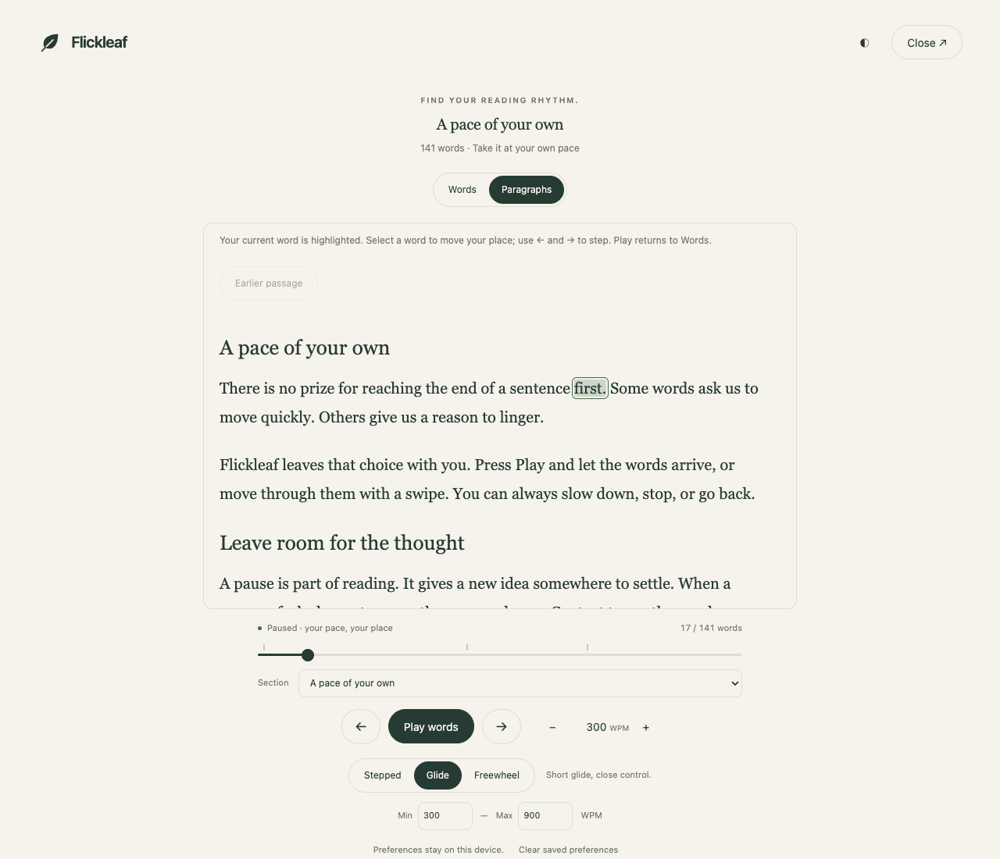

# Your first minute with Flickleaf

[Open the web reader](https://miguelbarroso.com/flickleaf/) and choose **Try a sample**, then **Start reading**. No account is needed.

1. Choose **Play**, or press Space or Enter, to start. Press again to pause.
2. Set a comfortable pace with the WPM field. Min and Max default to 300–900; slower limits are available.
3. In Words, scroll or swipe to move through the text. Stepped moves one word per notch with no glide; Glide eases off over a short distance; Freewheel keeps moving longer. Pause stops it.
4. Choose **Paragraphs** when you want context. Scroll normally, select a word to change your place, then choose **Play words** to continue.
5. Use the Section picker or the marks above the progress bar to revisit a heading.
6. Close the reader to edit your text. Closing or reloading the tab may discard the document.

These are unretouched captures of the shared web reader, version 0.6.0, using Flickleaf’s built-in sample. They demonstrate the UI, not a signed extension installation.

## Bring your own text

Paste a passage or choose **Open PDF**. PDFs are processed locally and must contain selectable text; the limit is 25 MB and 300 pages. Review extraction before reading. Optional cleanup previews repeated headers, footers, and page numbers. Hyphen joining can alter genuine compound words, so it stays optional.

Pace, limits, theme, and scroll mode are remembered locally. Document text is not saved. In 0.7.0, Save place optionally stores one text fingerprint and position locally; Delete saved place removes it. Reopen the same text to resume. You can clear saved preferences in the reader.

## Browser extensions

See the [README](../README.md) for current availability and developer installation. Firefox is publicly available on the [official listing](https://addons.mozilla.org/en-US/firefox/addon/flickleaf/). Chrome is a developer build; Safari requires Xcode and signing. On a phone, the web reader is the simplest starting point.
